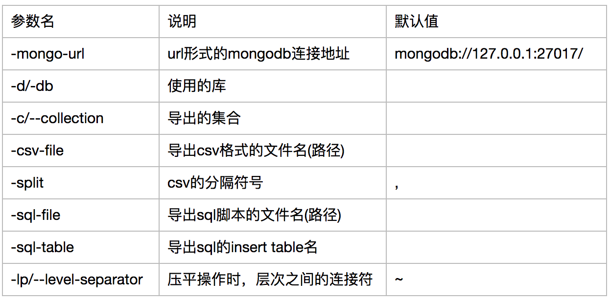
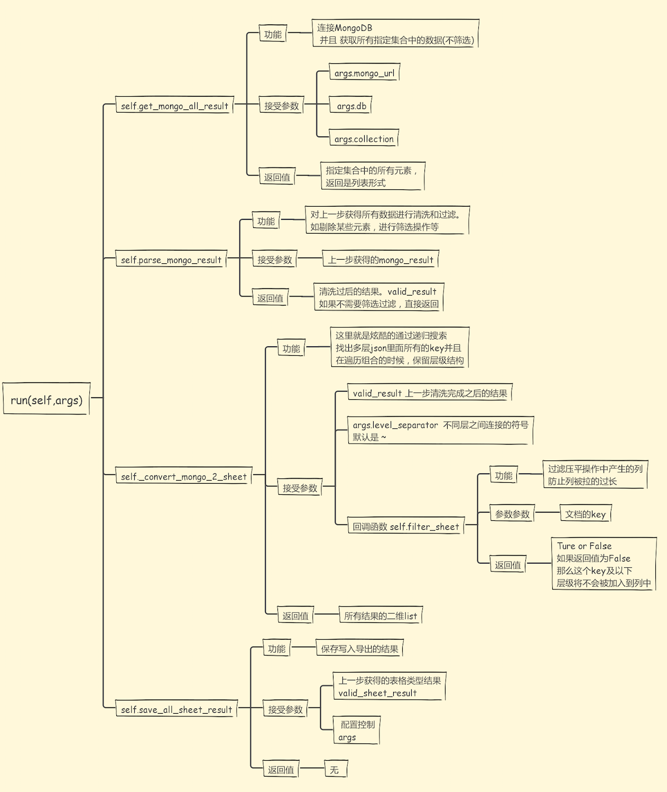

.. py_mongo_export documentation master file, created by
   sphinx-quickstart on Thu Aug 03 13:15:35 2017.
   You can adapt this file completely to your liking, but it should at least
   contain the root `toctree` directive.

综述
=====

----

对于MongoDB官方提供的导出工具 mongoexport 的不满，促使了py_mongo_export的产生。

一方面py_mongo_export 适应了mongoexport导出命令的用法，让你能从mongoexport 无缝切换到py_mongo_export，
另一方面，py_mongo_db 也提供了一个类似框架的作用，通过继承基础的导出类，你可以重写流程中的任何一个方法
，来实现 **快速和过滤** 定制导出内容的需求。

顺便说一下，py_mongo_export对于pythoner更加友好，毕竟可以用python写逻辑控制, 这可比写js更舒服不是吗~

mongoexport的烦恼
=========================

----

在工作中，我经常会面临着各种数据类型的etl转换。从MongoDB中导出数据到 **有着严格行列关系** 的表格，例如说Excel或MySQL中，就是很频繁的一个操作。

从MongoDB导出，毫无疑问官方的mongoexport 是我最开始的第一选择。最开始一般的数据倒是没有发现问题，但是随着数据源
的增加，使用mongoexport的烦恼也就来了。

* 导出csv的时候，每列没有用引号括起来，导致如果原文中有逗号(",")，那么列关系就会混乱，原文有逗号的那一列会识别为多列
* 还是因为上面那个问题，导出csv的时候，如果原文中有换行符等标志，导出的文件中也会被换行，导致行关系换乱。
* 想要对导出的数据进行逻辑操作，比如替换过滤或修改，让我一个pythoner觉得很不方便。
* 需要导入到MySQL的时候，无法直接生成insert脚本(尽管可以通过生成csv间接导入，但是生成的csv本身就不标准)
* 对于多层嵌套，有着层级结构的复杂json文档，导出只能导出顶层的key, value关系，顶层key必然不多，导致列的数量过少，列里面保存的数据多事{aa: bb, cc: [dd,ff]} 这样人工难以一眼识别的内容。

上面是导出格式的烦恼，还有对于导出逻辑的烦恼。因为毕竟，MongoDB作为一个nosql， 存储的是有着复杂 **层级结构** 的json
文档类型数据，强行把这样一个文档类型，转换为 **行列关系严格** 的表格类型数据本身就是不明智的。
下面我举一个例子来说明，最后一个 **多层嵌套只能导出顶层映射关系** 的问题

假使我现在有这样一个文档结构
::
    {
        "详细信息":{
                "名字":{
                    "firstName":"zhang",
                    "lastName":"yiTian"
                },
                "地址":{
                    "省份":{
                        "上海"
                    }
                }
        },
        "更新时间": "2017-08-06"
    }

那么我如果导出的话，mongoexport 给的结果是这样的

===========   ===========================================================================
更新时间            详细信息
===========   ===========================================================================
2017-08-06       {"名字":{"firstName":"zhang","lastName":"yiTian"},"地址":{"省份":{"上海"}}
===========   ===========================================================================

因为详细信息的field是复杂的json结构，导出的时候，只能导出最外层的对应关系，所以导致详细信息的区域无法人工阅读

.. _archives of the scrapy-users mailing list: https://groups.google.com/forum/#!forum/scrapy-users
.. _post a question: https://groups.google.com/forum/#!forum/scrapy-users
.. _StackOverflow using the scrapy tag: https://stackoverflow.com/tags/scrapy
.. _#scrapy IRC channel: irc://irc.freenode.net/scrapy
.. _issue tracker: https://github.com/scrapy/scrapy/issues

py_mongo_export 的改进
===========

.. toctree::
   :caption: py_mongo_export 的改进
   :hidden:

----

针对以上的烦恼，py_mongo_export 给出了如下药方：

* 导出csv的时候，自动给每一列的数据加上双引号"，如果原文中有双引号造成歧义的话，对原文双引号进行转义。这样逗号被包裹在双引号中，就不会被解释为新的一列。保证了 **列关系的准确性** 。同时对于回车和换行符，也被包裹在引号内，保证了 **行关系准确性** 的同时，也保证了不修改原文， **原文的准确性**
* 除了以逗号分隔的csv之外，还可以指定另类冷门的分隔符号(原文中永远不会出现的符号)，作为分列标准，如|, $, ç，√
* 支持直接导出insert的sql语句。同时对于文档类型来说， **列的个数是不确定的** ， 可能这个文档有3个属性，另外一个文档就会有4个。所以在导出insert的同时，也会自动生成建表语句。预先建立所有的列关系。
* 一个很酷炫的操作： 支持把 **多层嵌套的文档类型压平** ，同时 **不损失原文层级关系** ，变成规范化的表格形式

对于上面的一个压平操作，这里继续使用上面的例子作为演示说明，经过 **压平** 操作后，表格将会变成

===============  =============================  ============================  ==========================
更新时间           详细信息_名字_firstName           详细信息_名字_lastName            详细信息_地址_省份
===============  =============================  ============================  ==========================
2017-08-06       zhang                           yiTian                         上海
===============  =============================  ============================  ==========================

不仅仅找出了 **所有的对应关系** ， 同时还保留了 **层级结构** ，让你知道，比如说上海，是经过 详细信息 -> 地址 -> 省份 这样一步步下来的结果。 不要看这个例子没有什么明显感受，当数据的层次关系非常明显时，如果没有层级标志，你完全 **无法溯源** 出这个属性和属性值是在哪个区域下。

* 当本身document数量很多，同时层级结构key各不相同，导致列被拉的特别宽怎么办 ？py_mongo_export 在压平的时候同时提供了一个回调函数让你控制过滤，如果某个层级下的内容不需要被提取，直接在过滤函数里面验证就可以了。
* 可以替换的流程组件。当扩充了mongoexport之后的py_mongo_export任仍然无法满足数据清洗导出需求的话，只需要继承基础etl导出类，通过 **重写** 导出步骤的特定方法，达到高度定制解析的目的。

安装
===========

.. toctree::
   :caption: 安装
   :hidden:

----

pip方式
::
    pip install py_mongo_export

源代码安装
::
    python setup.py install

直接使用命令行导出
===============

----

样例1，导出MongoDB的easyspider库的food_add表里面所有数据，导出格式是sql 脚本格式
::
    py_mongo_export -mongo-url mongodb://localhost:27017 -d easyspider -c food_add \
    -csv-file test.csv

样例2，导出MongoDB的easyspider库的food_add表里面所有数据，导出格式是sql 脚本格式
::
    py_mongo_export -mongo-url mongodb://localhost:27017 -d easyspider -c food_add \
    -sql-table test_table -sql-file test_table.sql

py_mongo_export 接受的具体参数说明如下

核心流程
=============

----------

py_mongo_export 的核心流程非常直接简单，甚至可能让人觉得不能称得上框架这么厚重的词(可是谁让它的功能点本身就很简单明确，就是导出呢，这个导出这个确实是用不着大量的代码)。

py_mongo_export的核心基础类是 `base_etl` 。使用py_mongo_export的核心，就是调用py_mongo_export的run()方法。
run()方法控制着整个导出的流程。

对于一次导出，他的步骤是这样子的：
::
    读取参数配置, ->
    连接MongoDB并且一次取出集合中所有的数据 ->
    对取出的数据进行清洗 ->
    搜索多层文档中的每一层key，平铺成表格形式 ->
    将表格形式的结果写入

更加详细的图解说明

定制化导出
=============

----------

如果直接使用命令行参数的导出，没有满足你的要求的话，那么不要紧，你可以重写导出流程中的任何一个方法，定制你自己的导出逻辑。

你可以重写图解中的任何一个方法，来达到高度定制导出的目的。

这种重写方法来达到定制导出的效果有多好呢 ？ 一个很有力的证明就是：

py_mongo_export 实现了csv和sql格式的导出,而这两种不同方式的导出，其实这两种不同的导出，只是 **重写了各自的 save_all_sheet_result 方法而已**

csv格式的，就在 **拿到最终结果** 后 **以csv的逻辑写入** ，写入sql同理。

联系我
===============

* hhczy1003@163.com

